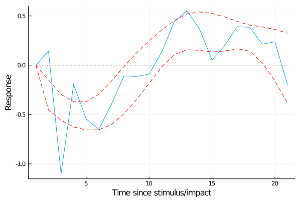

# julia-SmoothLocalProjections.jl
Implementation of Smooth Local Projections (SLP) based on [Barnichon and Brownlees (2019)](https://www.mitpressjournals.org/doi/abs/10.1162/rest_a_00778) - "Impulse Response Estimation by Smooth Local Projections." Original method of Local Projections is first introduced by [Òscar Jordà (2005)](https://www.aeaweb.org/articles?id=10.1257/0002828053828518)

The code was translated from MATLAB code published from the replication file made available by [C. Brownlees](https://github.com/ctbrownlees/MATLAB-package-lproj).

```julia
import Pkg;
Pkg.update();

using CSV, Statistics, LinearAlgebra: I;
cd(@__DIR__) #src location

include("func_slp.jl")
```

Input argument is constructed using a mutable object of following,

```julia
mutable struct InputPackage
  y        :: Array        # Defined endogenous variable for response.;
  x        :: Array        # Defined endogenous variable for generating shocks.;
  w        :: Array        # Defined endogenous variable - contemporaneous and lagged structure.;
  H_min    :: Int          # Horizon sought - start.;
  H_max    :: Int          # Horizon sought - end.;
  type     :: String       # Type of regression: 'reg' to be regular, smooth otherwise.;
  r        <: Float64      # Order of limit polynomial: 1 for smooth, 2 for linear pattern.;
  λ        <: Float64      # Value of penalty: Barnichon and Brwonlees (2019).;
end
```
Each stripped sub/co-routine is a plot of impulse response functions, (1 - blue line) local projection using [Òscar Jordà (2005)](https://www.aeaweb.org/articles?id=10.1257/0002828053828518); (2 - purple line) smoothed local projection using (λ = 100, for example presented below); (3 - red lines) smoothed local projection using optimal λ estimated using cross-validation method as shown in [Barnichon and Brownlees (2019)](https://www.mitpressjournals.org/doi/abs/10.1162/rest_a_00778) (red solid line is a point estimate, dashed red lines are estimated 90% confidence set).

Following example is a replication of [Barnichon and Brownlees (2019)](https://www.mitpressjournals.org/doi/abs/10.1162/rest_a_00778) estimation of the impulse response of Gross Domestic Product (GDP) to identified monetary policy shock.


